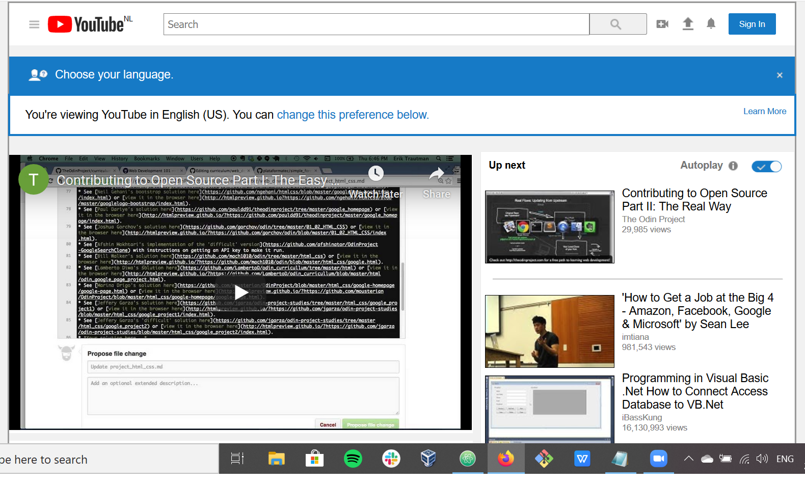

# Project Name

Tiago and Brandon's YouTube Clone project

Additional description about the project and its features.

This project was the first project compiled by Brandon and Tiago in the Microverse HTML/CSS section of the course work. It involved recreating an archived YouTube video page.

## Built With

- HTML and CSS
- VScode and Atom
- Windows10 and Ubuntu
- https://validator.w3.org was used to validate the HTML code in this project

## Live Demo

[Live Demo Link](https://rawcdn.githack.com/tiagoes/youtubeProject/fbb2380aa175fafb814c3db576f7ff083ffacdd7/index.html)

## Getting Started

To get your own copy of our project clone the repository to your local machine.

## Authors

👤 **Brandon Defoe**

- Github: [@defoebrand](https://github.com/defoebrand)

👤 **Tiago Alves**

- Github: [@tiagoes](https://github.com/tiagoes)

## 🤝 Contributing

Contributions, issues and feature requests are welcome!

Feel free to check the [issues page](issues/).

## Show your support

Give a ⭐️ if you like this project!

## Acknowledgments

- We use the embed url from youtube

## 📝 License

This project is licensed by Microverse and The Odin Project
